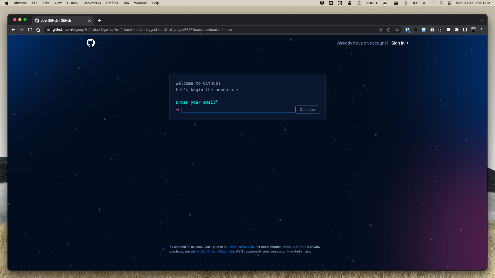
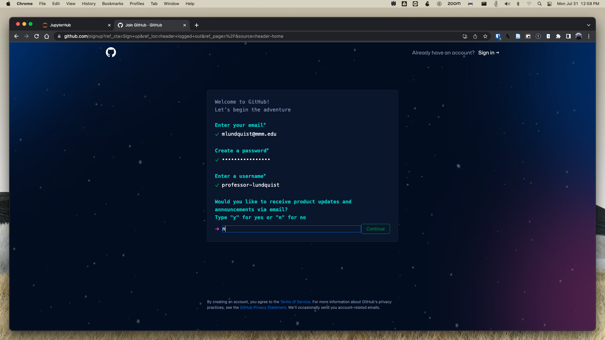
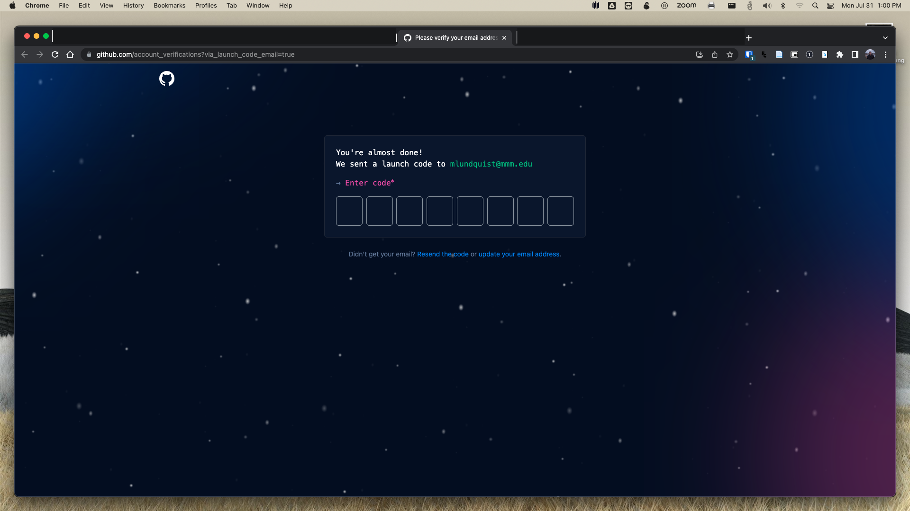
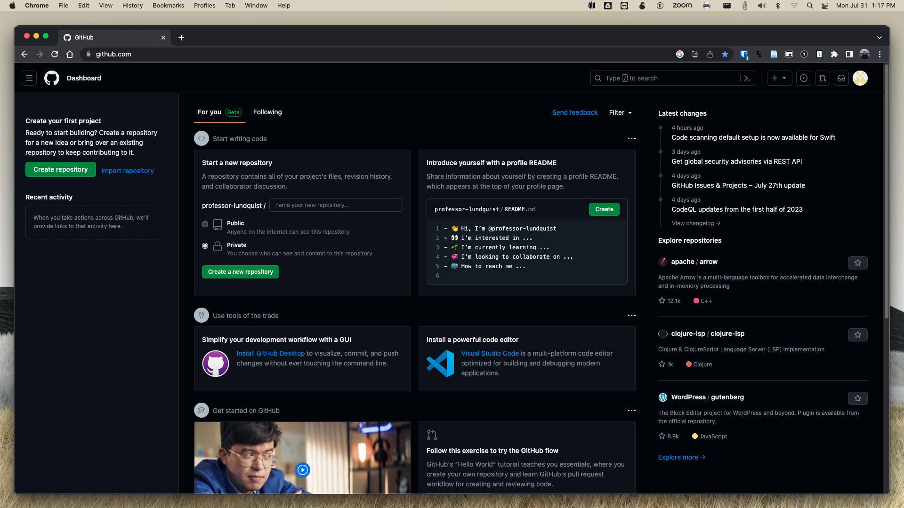
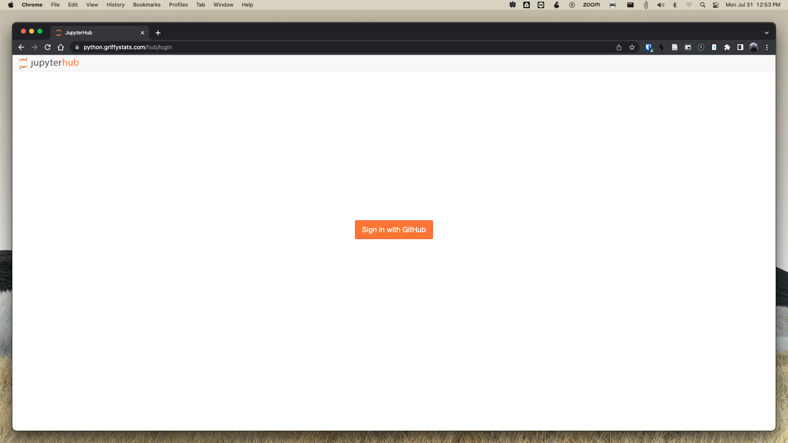
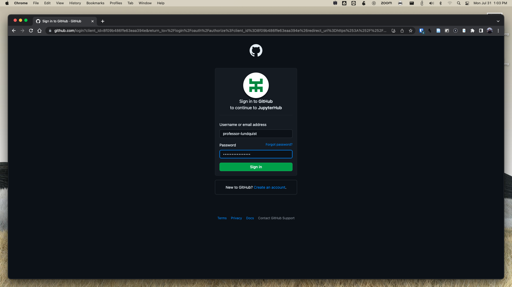
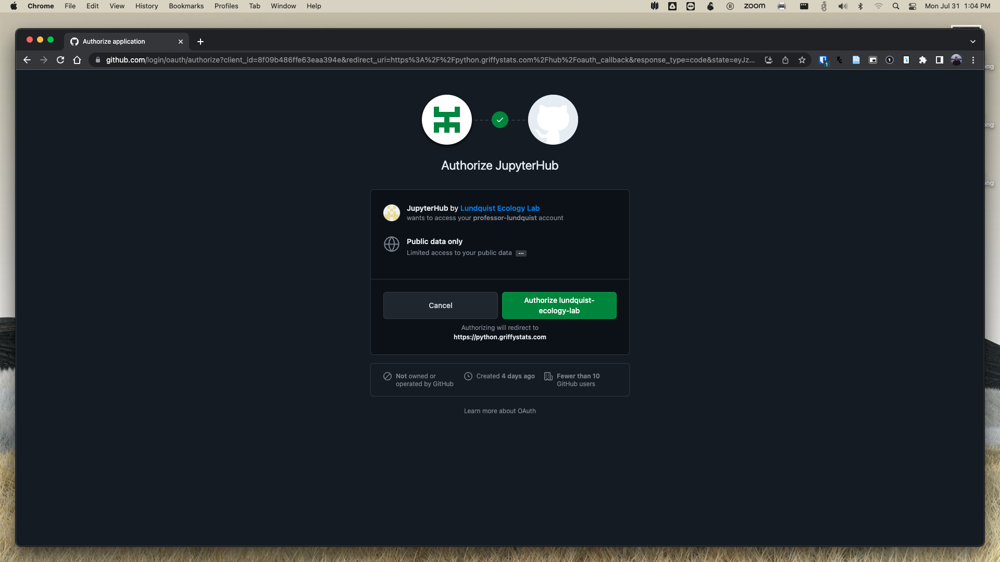
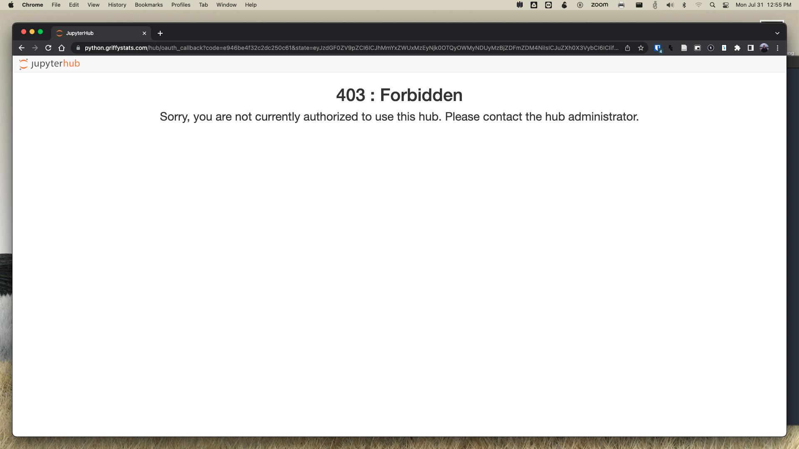
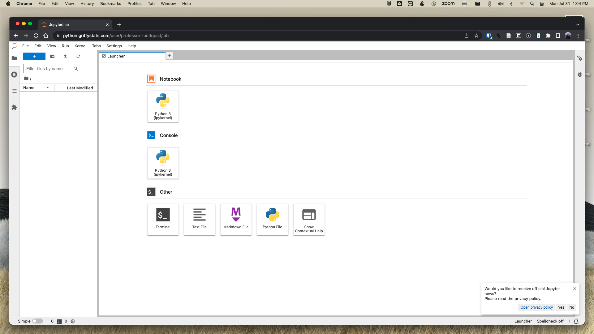

# Biostatistics (Biol 218) with Python textbook and assignments

Welcome to the GitHub repository for the textbook and assignments for Biostatistics (Biol 218) at Marymount Manhattan College.
In this course, we will be using the `Python` programming language through the use of Jupyter notebooks to
present information, work through problems, and produce statistical reports.

## Quick Start Guide

A complete walkthrough video can be found [here]()

Step 1: Read the [syllabus here](syllabus.md)

Step 2: Create user accounts for access to course content

- [Google Account](https://accounts.google.com/signup) (if you don't already have one)
- [GitHub Account](https://github.com/signup?ref_cta=Sign+up&ref_loc=header+logged+out&ref_page=%2F&source=header-home)

How to create a GitHub account:

1. Go to [https://github.com](https://github.com) and click on `Sign Up`

2. Enter your email address, create a username, and a strong password

3. GitHub will send you an email with a first-time code. Find that code and enter it on this page.

4. You are now logged in

You can now log out and log back in any time using your username or email.

Both of these accounts are free and can be deleted after the end of the course.

Step 3: Log into the course pages

- [Brightspace](mmm.brightspace.com) using your official MMC credentials
- [GriffyStats JupyerHub](python.griffystats.com) following the steps below:
  
Step 1: Go to [https://Python.GriffyStats.com](https://Python.GriffyStats.com)
  
  

Step 2: Click on `Sign in with GitHub` 

If you are not signed in you will see this screen, where you will need to enter your username and password for GitHub

  

After that, or if you are already logged in your will be prompted to click on `Authroize lundquist-ecology-lab`.

  

Step 3: _Email_ your username to Dr. Lundquist (mlundquist@mmm.edu)

Your username will automatically be blocked and you will see this screen. Dr. Lundquist needs to manually add your username to the authorized user list.

  

**Note: Please give Dr. Lundquist 24 hours to add your name to the authorized user list. He will send you a confirmation email**

Step 4: Once you have been authorized, go back to [https://Python.GriffyStats.com](https://Python.GriffyStats.com) and click on `Log in with GitHub`

  

You should now be brought to your personal JupyterHub instance. THere is where you will interact with the textbook and work on assignments for the course.

  

